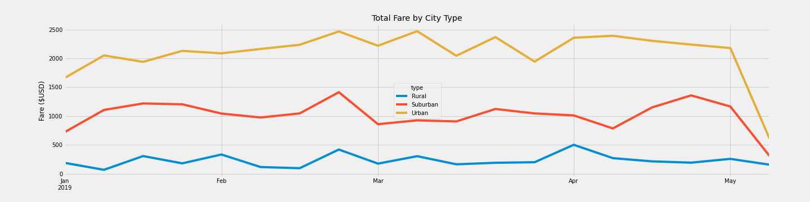

# PyBer Analysis

## Overview of the PyBer Analysis

### Purpose

##### The purpose of Module Five and the PyBer Analysis Challenge is to gain additional practice using Python and NumPy, and introduces the Matplotlib library and SciPy to create charts such as line charts, bar charts, scatter plots, bubble charts, pie charts, and box-and-whisker plots.  The Module Five PyBer Analysis required the analysis of two external CSV files of ride-sharing and city data including several cities and city types, driver counts, and ride-sharing fare amounts.  Using Pandas DataFrames and groupby, pivot, and resample functions, the data has been analyzed to determine total rides, total drivers, total fares, and average fare per ride and driver by rural, suburban, or urban city type.

### Results

##### The results of the PyBer Analysis Challenge highlights the differences in ride-sharing data among the rural, suburban, and urban city types. As shown in the PyBer Summary, the amount of total rides and total drivers in the rural cities is significantly less than total rides and total drivers in urban cities.  This is due to significantly less use of ride-sharing services in rural cities versus increased usage of ride-sharing services in suburban and especially in urban cities.  The minimal usage of ride-sharing services in rural cities, and potentially longer commutes in rural cities, leads to more favorable average fare per ride and average fare per driver.  Urban and suburban cities earn significantly higher fares of $39,854.38 and $19,356.33 than rural cities due to higher demand in these city types.

### Summary:

##### In summary, three recommendations I propose to the CEO include:
- **Increase marketing efforts in rural cities.**  Though total rides, total drivers, and total fares are lowest in the rural cities, there are higher margins on average fare per ride and average fare per driver due to potential longer commutes in rural cities (in comparison to shorter trips in urban cities resulting in lower fares).
- **Incentivize ride-sharing in suburban cities.** Suburban cities perform the second best in terms of overall fares and to continue gaining steady revenue in this category, PyBer could provide customers with incentive programs such as loyalty programs.
- **Ensure sufficient amount of drivers always available in urban cities.** Don't miss an opportunity for business to competitors!  Therefore always have enough drivers available in urban cities to shorten customer wait time and increase ride-sharing availability to PyBer customers.

